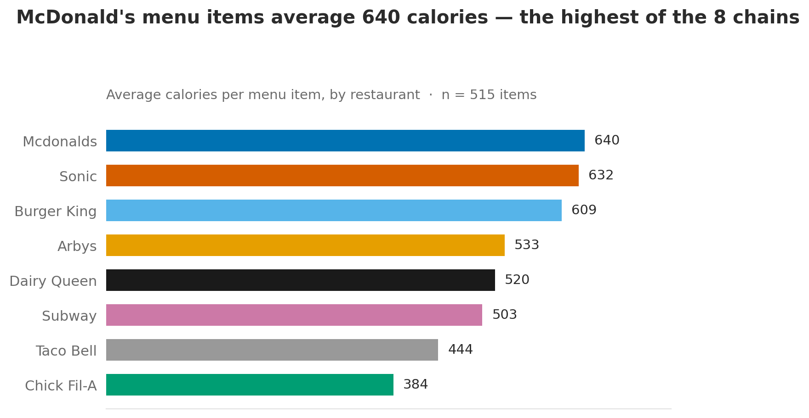
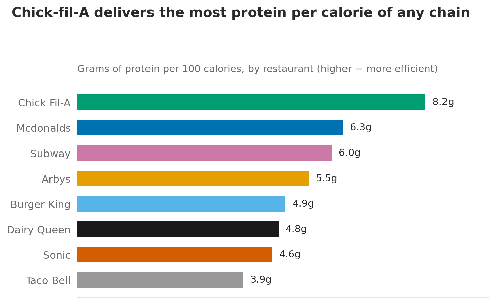
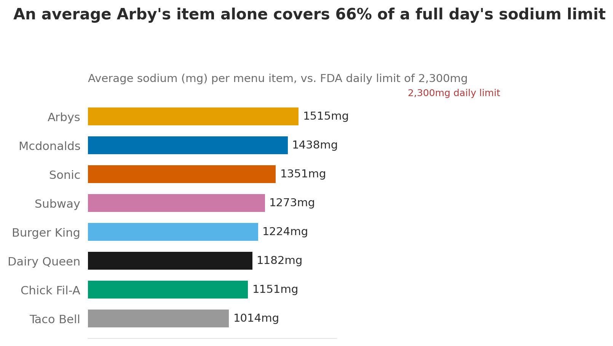

# Fast Food Nutrition Analysis — SQL Project

## Project Overview

**Project Title:** Fast Food Nutrition Analysis
**Database:** `fastfood_db` (SQLite)

This project demonstrates SQL skills and techniques typically used by data analysts to explore, clean, and analyze a real dataset — in this case, nutrition facts for 515 menu items across 8 major U.S. fast food chains. The project involves setting up a nutrition database, performing exploratory data analysis (EDA), and answering specific analytical questions through SQL queries: **which chain actually gives you the best nutritional value, and which single menu item comes closest to blowing your entire day's sodium budget in one order?**

## Objectives

1. **Set up a nutrition database:** Create and populate a database with the fast food nutrition dataset.
2. **Data Cleaning:** Identify missing values and decide, deliberately, which ones are safe to drop.
3. **Exploratory Data Analysis (EDA):** Perform basic exploratory analysis to understand the dataset's shape.
4. **Business Analysis:** Use SQL to answer specific analytical questions and derive insights from the nutrition data.

---

## Project Structure

### 1. Database Setup

SQLite doesn't use a `CREATE DATABASE` statement — the database is just the file `fastfood.db`, created automatically the first time you connect to it. A table named `fastfood` stores the nutrition data. The table structure includes columns for restaurant, item name, and 15 nutrition facts (calories, fat, cholesterol, sodium, carbs, fiber, sugar, protein, and more).

```sql
CREATE TABLE fastfood (
    restaurant     TEXT,
    item           TEXT,
    calories       INTEGER,
    cal_fat        INTEGER,
    total_fat      INTEGER,
    sat_fat        REAL,
    trans_fat      REAL,
    cholesterol    INTEGER,
    sodium         INTEGER,
    total_carb     INTEGER,
    fiber          REAL,
    sugar          INTEGER,
    protein        REAL,
    vit_a          REAL,
    vit_c          REAL,
    calcium        REAL,
    salad          TEXT
);
```

### 2. Data Exploration & Cleaning

- **Record Count:** determine the total number of menu items in the dataset.
- **Restaurant Count:** find out how many unique chains are represented.
- **Restaurant List:** identify all 8 chains in the dataset.
- **Null Value Check:** check for missing values and decide what to do about them.

```sql
SELECT COUNT(*) FROM fastfood;                        -- 515 rows
SELECT COUNT(DISTINCT restaurant) FROM fastfood;       -- 8 restaurants
SELECT DISTINCT restaurant FROM fastfood;

-- Check for nulls in the columns this analysis actually uses
SELECT *
FROM fastfood
WHERE calories IS NULL OR sodium IS NULL OR protein IS NULL OR sugar IS NULL;
```

**A deliberate cleaning decision, not a blanket one:** three columns (`vit_a`, `vit_c`, `calcium`) are missing on roughly 40% of rows, and `fiber` is missing on 12 rows — but `calories`, `sodium`, `sugar`, and `protein` (the columns every query below actually depends on) are missing only a single `protein` value. Deleting every row with *any* null would have thrown away 214 rows (41.6% of the dataset) to protect columns nothing here uses. Instead, only the row missing a value the analysis depends on gets dropped:

```sql
DELETE FROM fastfood
WHERE protein IS NULL;
```

### 3. Data Analysis & Findings

The following SQL queries answer specific analytical questions about the dataset (also available as a standalone file: [`sql/analysis_queries.sql`](sql/analysis_queries.sql)).

**1. Write a SQL query to find the average, minimum, and maximum calories per restaurant, ranked highest to lowest:**

```sql
SELECT
    restaurant,
    COUNT(*)                        AS menu_items,
    ROUND(AVG(calories), 0)         AS avg_calories,
    MIN(calories)                   AS min_calories,
    MAX(calories)                   AS max_calories
FROM fastfood
GROUP BY restaurant
ORDER BY avg_calories DESC;
```

**2. Write a SQL query to find the average sodium per restaurant, expressed as a percentage of the FDA's 2,300mg daily limit:**

```sql
SELECT
    restaurant,
    ROUND(AVG(sodium), 0)                AS avg_sodium_mg,
    ROUND(100.0 * AVG(sodium) / 2300, 1)  AS pct_of_daily_limit
FROM fastfood
GROUP BY restaurant
ORDER BY avg_sodium_mg DESC;
```

**3. Write a SQL query to find which restaurant gives you the best protein-to-calorie ratio:**

```sql
SELECT
    restaurant,
    ROUND(AVG(protein), 1)                         AS avg_protein_g,
    ROUND(AVG(calories), 0)                        AS avg_calories,
    ROUND(100.0 * AVG(protein) / AVG(calories), 2) AS protein_g_per_100cal
FROM fastfood
GROUP BY restaurant
ORDER BY protein_g_per_100cal DESC;
```

**4. Write a SQL query to find the single most caloric item at each restaurant, using a window function:**

```sql
WITH ranked AS (
    SELECT
        restaurant,
        item,
        calories,
        sodium,
        RANK() OVER (PARTITION BY restaurant ORDER BY calories DESC) AS calorie_rank
    FROM fastfood
)
SELECT restaurant, item, calories, sodium
FROM ranked
WHERE calorie_rank = 1
ORDER BY calories DESC;
```

**5. Write a SQL query to build a composite "health score" — rewarding protein, penalizing sugar and sodium — and rank the top 10 items:**

```sql
WITH bounds AS (
    SELECT
        MIN(sugar) AS min_sugar, MAX(sugar) AS max_sugar,
        MIN(sodium) AS min_sodium, MAX(sodium) AS max_sodium,
        MIN(protein) AS min_protein, MAX(protein) AS max_protein
    FROM fastfood
),
scored AS (
    SELECT
        f.restaurant,
        f.item,
        f.calories,
        f.protein,
        f.sugar,
        f.sodium,
        ROUND(
            100.0 * (f.protein - b.min_protein) / NULLIF(b.max_protein - b.min_protein, 0)
            - 50.0 * (f.sugar   - b.min_sugar)   / NULLIF(b.max_sugar   - b.min_sugar, 0)
            - 50.0 * (f.sodium  - b.min_sodium)  / NULLIF(b.max_sodium  - b.min_sodium, 0)
        , 1) AS health_score
    FROM fastfood f CROSS JOIN bounds b
)
SELECT restaurant, item, calories, protein, sugar, sodium, health_score
FROM scored
ORDER BY health_score DESC
LIMIT 10;
```

**6. Write a SQL query to find the share of each restaurant's menu that is "high calorie" (>800 cal):**

```sql
SELECT
    restaurant,
    COUNT(*) AS menu_items,
    SUM(CASE WHEN calories > 800 THEN 1 ELSE 0 END) AS items_over_800cal,
    ROUND(100.0 * SUM(CASE WHEN calories > 800 THEN 1 ELSE 0 END) / COUNT(*), 1) AS pct_over_800cal
FROM fastfood
GROUP BY restaurant
ORDER BY pct_over_800cal DESC;
```

**7. Write a SQL query to find the 10 highest-sodium single items in the entire dataset:**

```sql
SELECT
    restaurant,
    item,
    calories,
    sodium,
    ROUND(100.0 * sodium / 2300, 0) AS pct_of_daily_sodium_limit
FROM fastfood
ORDER BY sodium DESC
LIMIT 10;
```

### 4. Visualizations





These three charts are generated straight from the same query results above, using a small, self-contained Python script: [`viz/make_charts.py`](viz/make_charts.py) (matplotlib). Running `python viz/make_charts.py` from the repo root downloads the dataset, builds a local SQLite database, and regenerates all three PNGs — so the code behind every chart here is included and reproducible, not just the output.

Power BI was considered instead, but a plain script won out for three reasons: it's free and needs no extra software to view (charts render inline right in this README), the code that produced them is visible and auditable the same way the SQL is, and it keeps the whole project reproducible from a single `git clone` rather than a binary `.pbix` file GitHub can't preview. The queries above would plug directly into Power BI as a data source if a live, interactive dashboard version were needed later.

---

## Findings

- **Calorie range:** the average McDonald's menu item runs 640 calories, about 67% more than the average Chick-fil-A item (384 calories) — the widest spread of any two chains in the dataset.
- **Protein efficiency:** despite having the lowest average calories, Chick-fil-A leads every chain in protein efficiency at 8.3g of protein per 100 calories, more than double Taco Bell's 3.9g.
- **Sodium risk:** an average Arby's item alone covers 66% of the FDA's full-day sodium limit. One single item — McDonald's 20-piece Buttermilk Crispy Chicken Tenders — hits 264% of a full day's sodium limit by itself (6,080mg, alongside 2,430 calories).
- **Menu-wide risk:** Burger King (22.9%) and Sonic (22.6%) carry the largest share of high-calorie (>800 cal) items on their menus, even though McDonald's has the higher average — meaning menu-wide risk and "typical item" risk aren't the same question.
- **A methodology caveat, called out on purpose:** the composite health score in query 5 doesn't penalize total serving size, so it tends to rank oversized fried-chicken bundles (20-piece tenders, 30-piece nuggets) as "healthiest" simply because bulk orders carry more total protein. A more rigorous version would score *per 100 calories* rather than per item — a natural next step, and worth stating plainly rather than letting the metric's blind spot go unmentioned.

## Reports

- **Nutrition Summary:** per-restaurant averages for calories, sodium, and protein efficiency (queries 1–3).
- **Sodium Risk Report:** the 10 highest-sodium single items across all 8 chains, with each expressed as a % of a full day's recommended limit (query 7).
- **Menu Composition Report:** the share of each chain's menu that qualifies as high-calorie, surfacing menu-wide risk that a simple average hides (query 6).

---

## How to Reproduce

**Queries:**
1. Download the dataset: [`fastfood_calories.csv`](https://raw.githubusercontent.com/rfordatascience/tidytuesday/main/data/2018/2018-09-04/fastfood_calories.csv)
2. Import it into any SQL tool (e.g. [DB Browser for SQLite](https://sqlitebrowser.org/), free) as a table named `fastfood`.
3. Run the queries in `sql/analysis_queries.sql`.

**Charts:** with Python 3 and `pandas`/`matplotlib` installed, run `python viz/make_charts.py` from the repo root — it downloads the dataset and regenerates the three PNGs in `images/` automatically.

## Data Source

[`fastfood_calories.csv`](https://raw.githubusercontent.com/rfordatascience/tidytuesday/main/data/2018/2018-09-04/fastfood_calories.csv), from the [R for Data Science TidyTuesday project (2018-09-04)](https://github.com/rfordatascience/tidytuesday/blob/main/data/2018/2018-09-04/fastfood_calories.csv), originally compiled from each chain's published nutrition facts. Covers entrees only (515 items across 8 chains) — sides, drinks, and desserts are not included. Daily sodium limit reference: FDA recommended maximum of 2,300mg/day.

---

## Conclusion

This project is a practical introduction to SQL as a data analyst would actually use it: setting up a database, making a deliberate (not blanket) data-cleaning decision, exploring the data, and answering real analytical questions with `GROUP BY` aggregation, window functions, `CASE`-based conditional aggregation, and multi-CTE composite scoring. The findings — where each chain trades off calories, protein, and sodium, and where a simple average hides menu-wide risk — are the kind of insight that turns raw nutrition facts into an actual answer to "which one should I order from."

---

*Built by [Bilguun Boldchingis](https://www.linkedin.com/in/bilguun-boldchingis)*
